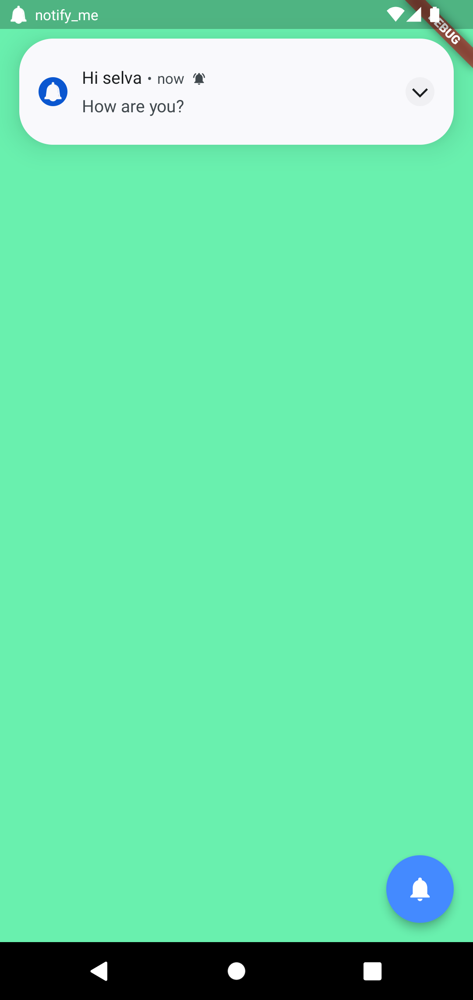
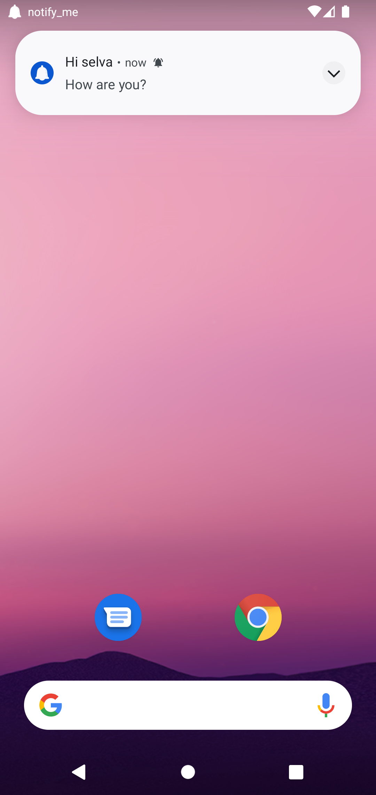
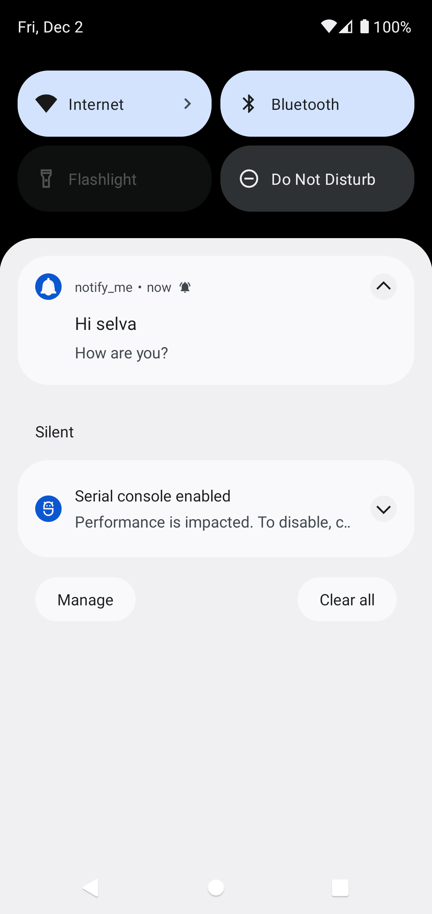

<h2 align="center">
NotifyMe
</h2>

<h3 align="center">
Simple flutter app for push notification using firebase 
</h3>

<h4 align="center">
Available for Android and iOS.
</h4>

 

## Demo

<h4 align="center">
Foreground
</h4>

   

<h4 align="center">
Background
</h4>

   

<h4 align="center">
Notification drawer
</h4>

   

## Push notification sample

<h3>
Send push notification from API platform.
</h3>

<h4>
url: https://fcm.googleapis.com/fcm/send
</h4>

<h4>
headers: {
"Content-Type": "application/json",
"Authorization": "Bearer $SERVER_KEY",
}
</h4>

<h4>
body: {
"to": //YOUR MOBILE FCM TOKEN,
"notification": {
"title": "Hi selva",
"body": "How are you?"
}
</h4>

}